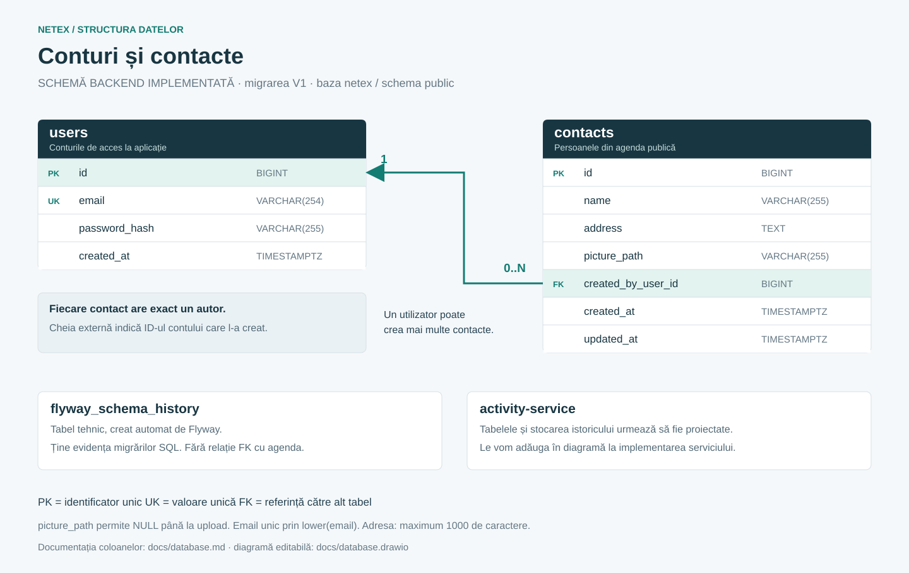
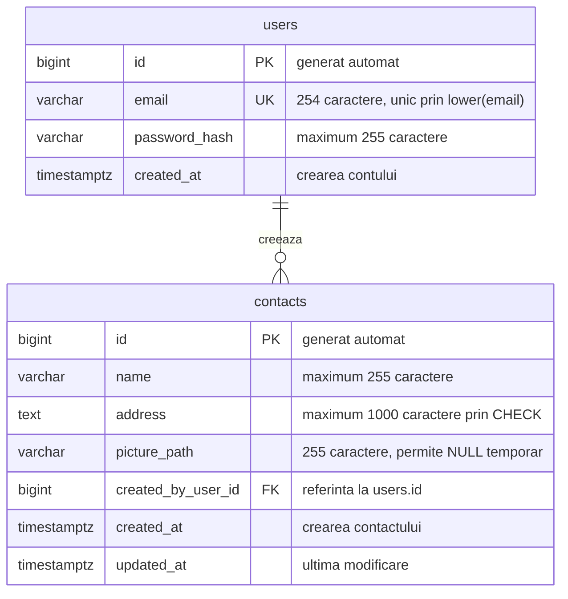

# Baza de date: tabele, relații și DBeaver

Acesta este documentul central pentru structura de date a întregului proiect. Îl actualizăm când adăugăm sau schimbăm un tabel. Diagrama se poate vedea în previzualizarea Markdown care suportă Mermaid și direct pe GitHub.

Diagrama există și ca fișiere independente: [imagine PNG](database.png), [imagine SVG](database.svg) și [diagramă editabilă draw.io](database.drawio). Pentru editare, deschide fișierul `.drawio` în draw.io / diagrams.net prin **File → Open From → Device**. Actualizăm diagrama și exporturile când schimbăm structura tabelelor.



- [Inventarul tabelelor](#inventarul-tabelelor)
- [Diagrama relațiilor](#diagrama-relațiilor)
- [Tabelul users](#tabelul-users)
- [Tabelul contacts](#tabelul-contacts)
- [Exemplu de legătură între rânduri](#exemplu-de-legătură-între-rânduri)
- [Istoricul Flyway](#istoricul-flyway)
- [Datele microserviciului](#datele-microserviciului)
- [Conectarea vizuală în DBeaver](#conectarea-vizuală-în-dbeaver)

## Stadiu

Pasul 2 este implementat și verificat. `compose.yaml` pornește PostgreSQL 17.11 cu volum persistent. Backendul se conectează prin Spring JDBC, iar Flyway 11.7.2 aplică migrarea V1 la pornire. În baza locală `netex` există `users`, `contacts` și `flyway_schema_history`. Cele două tabele ale aplicației sunt goale; istoricul are migrarea V1 aplicată cu succes.

Definiția executabilă este [V1__create_users_and_contacts.sql](../backend/src/main/resources/db/migration/V1__create_users_and_contacts.sql). Documentația de mai jos corespunde acestei migrări. Funcțiile de contact, conturi și upload vor fi adăugate în pașii următori; existența tabelelor nu înseamnă că API-urile sunt deja implementate.

## Inventarul tabelelor

| Componentă | Bază / tabel | Scop | Stare |
| --- | --- | --- | --- |
| `contacts-api` | `netex.public.users` | Conturile persoanelor care se autentifică | Creat prin V1 |
| `contacts-api` | `netex.public.contacts` | Contactele din agenda publică | Creat prin V1 |
| Flyway în `contacts-api` | `netex.public.flyway_schema_history` | Evidența modificărilor SQL aplicate | Creat automat de Flyway |
| `activity-service` | Tabel SQL de istoric, schema încă nestabilită | Evenimentele procesate despre înregistrări și contacte | De proiectat la etapa microserviciului |

`netex` este baza de date. `public` este schema, adică un spațiu de organizare a tabelelor în acea bază. `users` și `contacts` sunt numele tabelelor.

Frontendul va folosi API-ul Java și nu va avea o conexiune directă la SQL. Fotografiile vor fi fișiere într-un volum; în SQL vom păstra referința la fișier. Kafka transportă evenimentele și nu este un tabel SQL.

## Diagrama relațiilor



Relația în cuvinte: **un utilizator poate crea zero, unul sau mai multe contacte; fiecare contact are exact un autor**. Aceasta este o relație unu-la-mai-mulți. Legătura este `contacts.created_by_user_id → users.id`.

- **PK / PRIMARY KEY / cheie primară:** identifică unic un rând. Două rânduri din același tabel nu pot avea același ID.
- **FK / FOREIGN KEY / cheie externă:** leagă un rând de un rând existent din alt tabel. Un contact nu poate indica un autor inexistent.
- **UK / UNIQUE:** impune unicitatea unei valori, de exemplu emailul unui cont.
- **NOT NULL:** o regulă SQL care cere ca o coloană să aibă o valoare. Un text gol este tot o valoare; pentru el este necesară o validare separată.

## Tabelul users

Un rând reprezintă un cont de acces la aplicație. Acesta este diferit de un contact din agendă și de contul PostgreSQL `netex`, folosit de backend și DBeaver pentru conectare.

| Coloană | Tip SQL | Ce reprezintă | Reguli / comportament |
| --- | --- | --- | --- |
| `id` | `BIGINT` | Identificatorul contului | Cheie primară, `GENERATED ALWAYS AS IDENTITY` |
| `email` | `VARCHAR(254)` | Adresa pentru înregistrare și login | Obligatorie, fără spații la extremități; index unic pe `lower(email)` |
| `password_hash` | `VARCHAR(255)` | Hashul parolei | Obligatoriu; nu păstrăm parola în clar și nu returnăm hashul către frontend |
| `created_at` | `TIMESTAMPTZ` | Momentul creării contului | Obligatoriu; valoare implicită `CURRENT_TIMESTAMP` |

`BIGINT` este un număr întreg. `VARCHAR(n)` este text cu maximum `n` caractere. `TIMESTAMPTZ` reprezintă un moment în timp; PostgreSQL îl afișează în fusul orar al sesiunii și nu păstrează numele fusului orar original.

Indexul unic `uk_users_email` aplicat pe `lower(email)` refuză, de exemplu, înregistrarea simultană a adreselor `ana@example.com` și `ANA@example.com`. În DBeaver apare în lista de indexuri. Regula `ck_users_email_trimmed` refuză emailurile goale sau cu spații la extremități. La implementarea autentificării, backendul va normaliza și valida emailul înainte de salvare. SQL verifică deja unicitatea independent de codul Java. Hashul nu poate fi un text gol sau format numai din spații.

Hashingul transformă parola într-o valoare folosită pentru verificarea autentificării. Spring Security va compara parola introdusă la login cu hashul salvat. Hashingul nu este o criptare pe care aplicația o inversează ca să recupereze parola.

## Tabelul contacts

Un rând reprezintă o persoană din agendă. Persoana din contact nu trebuie să aibă un cont în aplicație: autorul rândului este utilizatorul care a adăugat-o.

| Coloană | Tip SQL | Ce reprezintă | Reguli / comportament |
| --- | --- | --- | --- |
| `id` | `BIGINT` | Identificatorul contactului | Cheie primară, `GENERATED ALWAYS AS IDENTITY` |
| `name` | `VARCHAR(255)` | Numele contactului | Obligatoriu; nu este unic, fiindcă două persoane pot avea același nume |
| `address` | `TEXT` | Adresa contactului | Obligatorie, maximum 1000 de caractere prin `CHECK` |
| `picture_path` | `VARCHAR(255)` | Numele/calea relativă a fotografiei | Permite `NULL` temporar; dacă este prezentă, nu poate fi goală. La upload va fi generată de server |
| `created_by_user_id` | `BIGINT` | Autorul contactului | Obligatoriu; cheie externă către `users.id`; backendul îl ia din sesiunea autentificată |
| `created_at` | `TIMESTAMPTZ` | Momentul creării contactului | Obligatoriu; valoare implicită `CURRENT_TIMESTAMP` |
| `updated_at` | `TIMESTAMPTZ` | Momentul ultimei modificări | Obligatoriu; valoare implicită `CURRENT_TIMESTAMP`; viitorul service Java îl va actualiza la editare |

`TEXT` nu limitează adresa la nivel de tip, dar constrângerea `ck_contacts_address_valid` impune maximum 1000 de caractere și refuză un text gol sau format numai din spații. Numele are și el o verificare pentru text gol/spații. Validarea viitorului API va aplica limite compatibile. `updated_at` nu se modifică automat doar datorită numelui coloanei sau unui `DEFAULT CURRENT_TIMESTAMP`; actualizarea va fi responsabilitatea codului Java.

Cerința finală include fotografia contactului. V1 permite `NULL` pentru `picture_path` ca să putem construi API-ul înainte de upload. La pasul 6 vom adăuga validarea fotografiei și vom decide migrarea necesară pentru contactele fără fotografie. Această stare intermediară nu încheie cerința de upload.

Cheia externă `fk_contacts_author` are `ON DELETE RESTRICT`: PostgreSQL refuză ștergerea unui cont care încă are contacte. Nu există o funcție de ștergere a conturilor în API. Indexul `idx_contacts_author` ajută găsirea contactelor unui autor și verificarea cheii externe. Nu am adăugat un index obișnuit pe nume: acesta nu ar accelera automat o căutare de tip „conține textul”.

La editare și ștergere, backendul va verifica dacă ID-ul utilizatorului autentificat coincide cu `created_by_user_id`. Cheia externă garantează existența autorului; **permisiunea de editare este verificată separat în backend**. Listarea și căutarea rămân publice.

## Exemplu de legătură între rânduri

Date fictive, numai pentru explicație; nu sunt inserate în baza de date.

`users` (afișăm doar coloanele relevante):

| id | email |
| --- | --- |
| 1 | ana@example.com |
| 2 | mihai@example.com |

`contacts` (afișăm doar coloanele relevante):

| id | name | created_by_user_id |
| --- | --- | --- |
| 10 | Maria Popescu | 1 |
| 11 | Andrei Ionescu | 1 |
| 12 | Elena Georgescu | 2 |

Ana a creat contactele 10 și 11. Mihai a creat contactul 12. Un contact cu `created_by_user_id = 999` ar fi refuzat dacă utilizatorul 999 nu există. ID-urile din cele două tabele au roluri diferite: `contacts.id` identifică un contact, iar `users.id` identifică un cont.

## Istoricul Flyway

Flyway a creat și administrează `flyway_schema_history`. Acest tabel nu are o relație de tip cheie externă cu `users` sau `contacts` și apare separat în diagrama vizuală.

Structura este furnizată de Flyway, nu o definim manual. Coloanele verificate în baza locală sunt:

| Coloană | Tip SQL | Scop |
| --- | --- | --- |
| `installed_rank` | `INTEGER` | Ordinea aplicării; cheia primară |
| `version` | `VARCHAR` | Versiunea migrării; poate fi NULL pentru alte tipuri de migrări |
| `description` | `VARCHAR` | Descrierea migrării |
| `type` | `VARCHAR` | Tipul migrării, de exemplu SQL |
| `script` | `VARCHAR` | Numele fișierului executat |
| `checksum` | `INTEGER` | Valoare folosită pentru a detecta schimbarea fișierului; poate fi NULL |
| `installed_by` | `VARCHAR` | Utilizatorul bazei care a aplicat migrarea |
| `installed_on` | `TIMESTAMP` | Momentul aplicării; acest câmp tehnic este fără fus orar |
| `execution_time` | `INTEGER` | Durata execuției în milisecunde |
| `success` | `BOOLEAN` | Dacă migrarea a reușit |

Prima migrare aplicată este `V1__create_users_and_contacts.sql`. Modificările viitoare vor avea migrări noi, de exemplu `V2__add_contact_field.sql`. Nu rescriem V1 după aplicare: Flyway verifică checksumul și semnalează diferențele. În DBeaver, istoricul arată acum versiunea `1`, fișierul V1 și `success = true`.

## Datele microserviciului

`activity-service` va procesa înregistrări primite prin Kafka și activități despre contacte primite prin HTTP. Am decis să păstrăm rezultatul procesării într-un tabel SQL de istoric deținut de microserviciu, pentru ca viitoarea pagină admin să poată afișa evenimentele. Schema, coloanele și migrarea acelui tabel se vor proiecta la implementarea Kafka; nu există momentan tabele ale microserviciului.

Pentru accesul la pagina admin, tabelul `users` va primi printr-o migrare viitoare un rol (`USER` sau `ADMIN`). V1 și diagrama curentă reprezintă doar schema deja implementată, fără această coloană. Înregistrarea publică va crea numai conturi `USER`; contul admin va fi configurat separat pe server.

La implementare vom completa aici numele bazei/schemei, fiecare tabel, coloanele și modul de identificare a evenimentelor. Legăturile prin ID-uri transmise în evenimente vor fi explicate separat de cheile externe SQL; nu presupunem o bază comună sau chei externe între serviciile independente.

## Cum păstrăm documentul actualizat

La fiecare schimbare de schemă, actualizăm în același pas inventarul, diagrama, coloanele și starea implementării. Migrarea SQL aplicată este definiția executabilă; documentul trebuie să corespundă acelei definiții. Același principiu se aplică viitoarelor tabele ale microserviciului.

## Ce reprezintă fiecare componentă

- PostgreSQL este programul care păstrează și gestionează bazele de date.
- Imaginea Docker conține PostgreSQL și fișierele necesare rulării lui.
- Containerul este instanța pornită din acea imagine.
- Volumul `postgres_data` păstrează datele independent de container.
- DBeaver este aplicația prin care vezi bazele, tabelele și rândurile.
- Flyway execută migrările SQL neaplicate la pornirea backendului.

## Pornirea bazei

1. Deschide Docker Desktop și așteaptă pornirea motorului Docker.
2. În rădăcina repository-ului, copiază `.env.example` în `.env` doar dacă nu există deja `.env`. Alege o parolă locală în fișierul nou.
3. Din același director rulează `docker compose up -d --wait postgres`.

`-d` lasă containerul în fundal. `--wait` așteaptă verificarea de disponibilitate. Comanda `pg_isready` din `healthcheck` verifică dacă PostgreSQL acceptă conexiuni; nu verifică parola clientului sau existența tabelelor aplicației. Conectarea din DBeaver verifică și datele de autentificare.

În `compose.yaml`, `image` alege versiunea, `environment` trimite setările bazei către container, `ports` permite accesul de pe laptop, iar `volumes` păstrează datele. `${POSTGRES_DB:-netex}` înseamnă valoarea din mediu sau, dacă lipsește, `netex`. Pentru parolă, expresia `:?` oprește pornirea cu un mesaj clar dacă valoarea lipsește. `$$` din verificarea de disponibilitate lasă variabila să fie citită în container.

Portul este publicat numai pe `127.0.0.1:5432`, pentru acces local. `netex` este numele bazei și, implicit, numele contului PostgreSQL de dezvoltare. Acest cont este creat de imagine cu drepturi de administrare locală și este diferit de viitorii utilizatori ai aplicației.

## Conectarea vizuală în DBeaver

1. Deschide **Database → New Database Connection**.
2. Alege **PostgreSQL**, apoi **Next**.
3. Completează:

| Câmp | Valoare implicită |
| --- | --- |
| Host | `localhost` |
| Port | `5432` |
| Database | `netex` |
| Username | `netex` |
| Password | Valoarea de după `POSTGRES_PASSWORD=` din fișierul `.env` de la rădăcină |

4. Apasă **Test Connection**. La prima folosire, DBeaver poate cere descărcarea driverului PostgreSQL; acesta îi permite să comunice cu serverul.
5. După mesajul de succes, apasă **Finish**.
6. În navigator, extinde conexiunea, apoi **Schemas → public → Tables**. În funcție de configurarea navigatorului, poate apărea și nivelul **Databases → netex**.

După prima pornire a backendului, dă **Refresh** pe conexiune sau pe **Tables**. Trebuie să vezi `users`, `contacts` și `flyway_schema_history`. Pentru coloane, deschide tabelul și secțiunea **Columns**. Pentru rânduri, folosește **View Data → All Rows**. `users` și `contacts` sunt goale până implementăm crearea de conturi și contacte. Istoricul Flyway are deja migrarea V1.

O eroare de conexiune refuzată indică de obicei un container oprit sau un port greșit. O eroare de autentificare cere verificarea utilizatorului și parolei. Schimbarea parolei în `.env` după inițializarea volumului nu schimbă automat parola din PostgreSQL.

## Date persistente și oprire

`docker compose stop postgres` oprește containerul. `docker compose up -d --wait postgres` îl pornește din nou. `docker compose down` elimină containerul și rețeaua proiectului, dar păstrează volumul cu date. Opțiunea `down -v` șterge și volumul cu baza; nu o folosi pentru o oprire obișnuită. Volumul local nu este trimis pe GitHub.

## Pornirea backendului cu baza locală

Un profil Spring este un set de configurări pentru un anumit mod de rulare. Am adăugat profilul `local`, care citește `.env` de la rădăcina repository-ului. Nu copiază parola în cod sau în Git.

După pornirea PostgreSQL, din directorul `backend` rulează în PowerShell:

```powershell
.\mvnw.cmd spring-boot:run "-Dspring-boot.run.profiles=local"
```

În IntelliJ: **Run → Edit Configurations → ContactsApiApplication**, cu **Program arguments** `--spring.profiles.active=local` și **Working directory** setat la directorul `backend` al proiectului. La nevoie, afișează câmpul Program arguments din **Modify options**. Reîncarcă proiectul Maven după schimbările din `pom.xml`.

`application.properties` configurează conexiunea la PostgreSQL. `application-local.properties` adaugă `spring.config.import=file:../.env[.properties]`: `../` înseamnă directorul părinte al directorului de lucru, iar `[.properties]` spune cum să fie citit fișierul. Păstrează `.env` în format simplu `KEY=value`, fără ghilimele, `export`, backslashuri sau substituții de variabile. Docker citește `.env` pentru Compose; Spring îl citește numai prin acest profil explicit. La rularea din Docker vom transmite variabilele direct, fără profilul `local`.

Valorile folosite sunt `POSTGRES_HOST` (implicit localhost), `POSTGRES_PORT` (5432), `POSTGRES_DB` (netex), `POSTGRES_USER` (netex) și `POSTGRES_PASSWORD` (fără parolă implicită). Modificarea hostului sau portului backendului nu schimbă automat configurația Compose. În Docker, hostul va fi numele serviciului `postgres`.

La prima pornire vezi în log migrarea la versiunea 1. La următoarele porniri, Flyway validează fișierul și raportează că schema este deja actualizată. Backendul nu poate porni complet dacă baza nu este disponibilă sau autentificarea eșuează. `/api/health` include acum și verificarea conexiunii SQL, dar ascunde detaliile interne.

## Verificări efectuate

`mvnw.cmd verify` a trecut cu 8 teste de backend. Testcontainers pornește un PostgreSQL 17.11 temporar pe un port disponibil, aplică V1 pe o bază goală și îl închide după teste. Nu folosește baza `netex` și nu are nevoie de parola ei. Testele verifică migrarea o singură dată, relația cu autorul, ID-urile și datele generate, unicitatea emailului fără diferențiere de litere mari/mici, autorii inexistenți, ștergerea unui autor cu contacte și numele goale. Cele două teste health au fost păstrate și rulează cu baza de test.

Backendul cu profilul `local` a aplicat apoi V1 în `netex`; verificarea a confirmat 0 utilizatori, 0 contacte și o migrare reușită în istoric. Health a răspuns HTTP 200 cu UP. PostgreSQL rămâne disponibil pentru inspecție în DBeaver.

Următorul pas este API-ul contactelor. Entitățile, repository-urile și operațiile HTTP vor folosi schema existentă; momentan avem conexiunea SQL și migrarea, fără operații de contact implementate.
