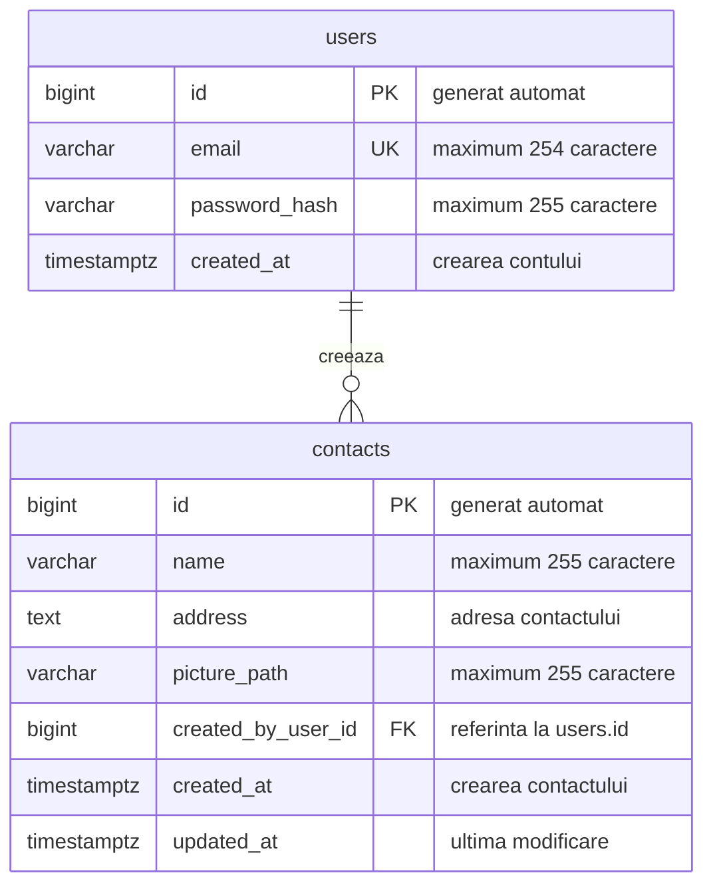

# Baza de date: tabele, relații și DBeaver

Acesta este documentul central pentru structura de date a întregului proiect. Îl actualizăm când adăugăm sau schimbăm un tabel. Diagrama se poate vedea în previzualizarea Markdown care suportă Mermaid și direct pe GitHub.

- [Inventarul tabelelor](#inventarul-tabelelor)
- [Diagrama relațiilor](#diagrama-relațiilor)
- [Tabelul users](#tabelul-users)
- [Tabelul contacts](#tabelul-contacts)
- [Exemplu de legătură între rânduri](#exemplu-de-legătură-între-rânduri)
- [Istoricul Flyway](#istoricul-flyway)
- [Datele microserviciului](#datele-microserviciului)
- [Conectarea vizuală în DBeaver](#conectarea-vizuală-în-dbeaver)

## Stadiu

Pasul 2 este în lucru. `compose.yaml` pornește PostgreSQL 17.11 și păstrează datele într-un volum Docker. Backendul nu este încă legat la bază, iar tabelele aplicației nu sunt create. Primul punct de verificare pentru învățare este conectarea din DBeaver la baza goală.

**Tot ce apare mai jos ca structură de tabel este propus, nu executat în PostgreSQL.** Când implementăm migrarea, actualizăm acest document după SQL-ul real. Un fișier Markdown explică structura; fișierul SQL este cel care o creează.

## Inventarul tabelelor

| Componentă | Bază / tabel | Scop | Stare |
| --- | --- | --- | --- |
| `contacts-api` | `netex.public.users` | Conturile persoanelor care se autentifică | Planificat |
| `contacts-api` | `netex.public.contacts` | Contactele din agenda publică | Planificat |
| Flyway în `contacts-api` | `netex.public.flyway_schema_history` | Evidența modificărilor SQL aplicate | Va fi creat automat de Flyway |
| `activity-service` | Stocarea și tabelele încă nestabilite | Istoricul înregistrărilor și modificărilor contactelor | De proiectat la etapa microserviciului |

`netex` este baza de date. `public` este schema, adică un spațiu de organizare a tabelelor în acea bază. `users` și `contacts` sunt numele tabelelor.

Frontendul va folosi API-ul Java și nu va avea o conexiune directă la SQL. Fotografiile vor fi fișiere într-un volum; în SQL vom păstra referința la fișier. Kafka transportă evenimentele și nu este un tabel SQL.

## Diagrama relațiilor

Relația în cuvinte: **un utilizator poate crea zero, unul sau mai multe contacte; fiecare contact are exact un autor**. Aceasta este o relație unu-la-mai-mulți. Legătura este `contacts.created_by_user_id → users.id`.

- **PK / PRIMARY KEY / cheie primară:** identifică unic un rând. Două rânduri din același tabel nu pot avea același ID.
- **FK / FOREIGN KEY / cheie externă:** leagă un rând de un rând existent din alt tabel. Un contact nu poate indica un autor inexistent.
- **UK / UNIQUE:** impune unicitatea unei valori, de exemplu emailul unui cont.
- **NOT NULL:** o regulă SQL care cere ca o coloană să aibă o valoare. Un text gol este tot o valoare; pentru el este necesară o validare separată.

## Tabelul users

Un rând reprezintă un cont de acces la aplicație. Acesta este diferit de un contact din agendă și de contul PostgreSQL `netex`, folosit de backend și DBeaver pentru conectare.

| Coloană | Tip SQL propus | Ce reprezintă | Reguli / comportament propus |
| --- | --- | --- | --- |
| `id` | `BIGINT` | Identificatorul contului | Cheie primară, generată automat de PostgreSQL |
| `email` | `VARCHAR(254)` | Adresa pentru înregistrare și login | Obligatorie și unică; normalizată înainte de salvare |
| `password_hash` | `VARCHAR(255)` | Hashul parolei | Obligatoriu; nu păstrăm parola în clar și nu returnăm hashul către frontend |
| `created_at` | `TIMESTAMPTZ` | Momentul creării contului | Obligatoriu; valoarea inițială poate fi dată de `CURRENT_TIMESTAMP` |

`BIGINT` este un număr întreg. `VARCHAR(n)` este text cu maximum `n` caractere. `TIMESTAMPTZ` reprezintă un moment în timp; PostgreSQL îl afișează în fusul orar al sesiunii și nu păstrează numele fusului orar original.

Emailurile vor fi normalizate consecvent în backend, inclusiv pentru litere mari/mici, astfel încât variantele aceleiași adrese să nu creeze conturi diferite. La migrare și autentificare vom fixa și verifica regula exactă din SQL și Java.

Hashingul transformă parola într-o valoare folosită pentru verificarea autentificării. Spring Security va compara parola introdusă la login cu hashul salvat. Hashingul nu este o criptare pe care aplicația o inversează ca să recupereze parola.

## Tabelul contacts

Un rând reprezintă o persoană din agendă. Persoana din contact nu trebuie să aibă un cont în aplicație: autorul rândului este utilizatorul care a adăugat-o.

| Coloană | Tip SQL propus | Ce reprezintă | Reguli / comportament propus |
| --- | --- | --- | --- |
| `id` | `BIGINT` | Identificatorul contactului | Cheie primară, generată automat |
| `name` | `VARCHAR(255)` | Numele contactului | Obligatoriu; nu este unic, fiindcă două persoane pot avea același nume |
| `address` | `TEXT` | Adresa contactului | Obligatorie; un singur câmp text, cu limită de lungime verificată în backend |
| `picture_path` | `VARCHAR(255)` | Numele/calea relativă a fotografiei | Generată de server, de exemplu `a82f6c01.jpg`; fișierul propriu-zis este în volumul de fotografii |
| `created_by_user_id` | `BIGINT` | Autorul contactului | Obligatoriu; cheie externă către `users.id`; backendul îl ia din sesiunea autentificată |
| `created_at` | `TIMESTAMPTZ` | Momentul creării contactului | Obligatoriu; se stabilește la creare |
| `updated_at` | `TIMESTAMPTZ` | Momentul ultimei modificări | Obligatoriu; la creare poate fi egal cu `created_at`, apoi backendul îl actualizează la fiecare editare |

`TEXT` permite stocarea unei adrese fără o limită mică declarată în tipul coloanei. Validarea aplicației va impune totuși o lungime rezonabilă. `updated_at` nu se modifică automat doar datorită numelui coloanei sau unui `DEFAULT CURRENT_TIMESTAMP`; actualizarea va fi responsabilitatea codului Java.

Cerința finală include fotografia contactului. Regulile exacte ale coloanei la etapa intermediară fără upload și validările finale vor fi stabilite în migrare și la implementarea fotografiilor.

La editare și ștergere, backendul va verifica dacă ID-ul utilizatorului autentificat coincide cu `created_by_user_id`. Cheia externă garantează existența autorului; **permisiunea de editare este verificată separat în backend**. Listarea și căutarea rămân publice.

## Exemplu de legătură între rânduri

Date fictive, numai pentru explicație; nu sunt inserate în baza de date.

`users` (afișăm doar coloanele relevante):

| id | email |
| --- | --- |
| 1 | ana@example.com |
| 2 | mihai@example.com |

`contacts` (afișăm doar coloanele relevante):

| id | name | created_by_user_id |
| --- | --- | --- |
| 10 | Maria Popescu | 1 |
| 11 | Andrei Ionescu | 1 |
| 12 | Elena Georgescu | 2 |

Ana a creat contactele 10 și 11. Mihai a creat contactul 12. Un contact cu `created_by_user_id = 999` ar fi refuzat dacă utilizatorul 999 nu există. ID-urile din cele două tabele au roluri diferite: `contacts.id` identifică un contact, iar `users.id` identifică un cont.

## Istoricul Flyway

Flyway va crea și administra `flyway_schema_history`. Acest tabel nu are o relație de tip cheie externă cu `users` sau `contacts` și nu este afișat în diagrama datelor aplicației.

El păstrează informații despre migrări: versiune, descriere, fișierul SQL executat, checksum pentru detectarea modificărilor, ordinea și momentul aplicării, durata și rezultatul execuției. Structura exactă este furnizată de versiunea Flyway integrată, nu o definim manual.

Prima migrare va fi `V1__create_users_and_contacts.sql`. După aplicarea ei, modificările viitoare vor avea migrări noi, de exemplu `V2__add_contact_field.sql`. În DBeaver vom putea vedea atât tabelele aplicației, cât și istoricul Flyway.

## Datele microserviciului

`activity-service` va procesa înregistrări primite prin Kafka și activități despre contacte primite prin HTTP. Persistența lui și coloanele pentru istoricul evenimentelor nu au fost încă proiectate. Nu există momentan tabele ale microserviciului.

La implementare vom completa aici numele bazei/schemei, fiecare tabel, coloanele și modul de identificare a evenimentelor. Legăturile prin ID-uri transmise în evenimente vor fi explicate separat de cheile externe SQL; nu presupunem o bază comună sau chei externe între serviciile independente.

## Cum păstrăm documentul actualizat

La fiecare schimbare de schemă, actualizăm în același pas inventarul, diagrama, coloanele și starea implementării. Migrarea SQL aplicată este definiția executabilă; documentul trebuie să corespundă acelei definiții. Același principiu se aplică viitoarelor tabele ale microserviciului.

## Ce reprezintă fiecare componentă

- PostgreSQL este programul care păstrează și gestionează bazele de date.
- Imaginea Docker conține PostgreSQL și fișierele necesare rulării lui.
- Containerul este instanța pornită din acea imagine.
- Volumul `postgres_data` păstrează datele independent de container.
- DBeaver este aplicația prin care vezi bazele, tabelele și rândurile.
- Flyway va executa fișierele SQL care definesc tabelele, la pornirea backendului.

## Pornirea bazei

1. Deschide Docker Desktop și așteaptă pornirea motorului Docker.
2. În rădăcina repository-ului, copiază `.env.example` în `.env` doar dacă nu există deja `.env`. Alege o parolă locală în fișierul nou.
3. Din același director rulează `docker compose up -d --wait postgres`.

`-d` lasă containerul în fundal. `--wait` așteaptă verificarea de disponibilitate. Comanda `pg_isready` din `healthcheck` verifică dacă PostgreSQL acceptă conexiuni; nu verifică parola clientului sau existența tabelelor aplicației. Conectarea din DBeaver verifică și datele de autentificare.

În `compose.yaml`, `image` alege versiunea, `environment` trimite setările bazei către container, `ports` permite accesul de pe laptop, iar `volumes` păstrează datele. `${POSTGRES_DB:-netex}` înseamnă valoarea din mediu sau, dacă lipsește, `netex`. Pentru parolă, expresia `:?` oprește pornirea cu un mesaj clar dacă valoarea lipsește. `$$` din verificarea de disponibilitate lasă variabila să fie citită în container.

Portul este publicat numai pe `127.0.0.1:5432`, pentru acces local. `netex` este numele bazei și, implicit, numele contului PostgreSQL de dezvoltare. Acest cont este creat de imagine cu drepturi de administrare locală și este diferit de viitorii utilizatori ai aplicației.

## Conectarea vizuală în DBeaver

1. Deschide **Database → New Database Connection**.
2. Alege **PostgreSQL**, apoi **Next**.
3. Completează:

| Câmp | Valoare implicită |
| --- | --- |
| Host | `localhost` |
| Port | `5432` |
| Database | `netex` |
| Username | `netex` |
| Password | Valoarea de după `POSTGRES_PASSWORD=` din fișierul `.env` de la rădăcină |

4. Apasă **Test Connection**. La prima folosire, DBeaver poate cere descărcarea driverului PostgreSQL; acesta îi permite să comunice cu serverul.
5. După mesajul de succes, apasă **Finish**.
6. În navigator, extinde conexiunea, apoi **Schemas → public → Tables**. În funcție de configurarea navigatorului, poate apărea și nivelul **Databases → netex**.

La acest punct nu trebuie să vezi `users` sau `contacts`: baza este creată, dar schema aplicației va veni prin Flyway. După aplicarea migrării vei da **Refresh** și vei vedea tabelele. Pentru rândurile unui tabel, folosește **View Data → All Rows**.

O eroare de conexiune refuzată indică de obicei un container oprit sau un port greșit. O eroare de autentificare cere verificarea utilizatorului și parolei. Schimbarea parolei în `.env` după inițializarea volumului nu schimbă automat parola din PostgreSQL.

## Date persistente și oprire

`docker compose stop postgres` oprește containerul. `docker compose up -d --wait postgres` îl pornește din nou. `docker compose down` elimină containerul și rețeaua proiectului, dar păstrează volumul cu date. Opțiunea `down -v` șterge și volumul cu baza; nu o folosi pentru o oprire obișnuită. Volumul local nu este trimis pe GitHub.

## Următoarea parte a pasului 2

Vom conecta backendul la baza de date și vom adăuga `backend/src/main/resources/db/migration/V1__create_users_and_contacts.sql`. Tabelele planificate sunt `users` și `contacts`, legate prin autorul contactului. Diagrama și coloanele propuse sunt documentate mai sus; le vom alinia cu definiția SQL exactă odată cu migrarea.

Backendul rulat din IntelliJ va folosi `localhost:5432`. Mai târziu, din Docker, va folosi numele serviciului `postgres:5432`. Docker Compose citește fișierul `.env` pentru configurația sa; backendul pornit separat din IntelliJ nu primește automat aceste variabile. Configurarea backendului va fi documentată la integrarea Flyway.
