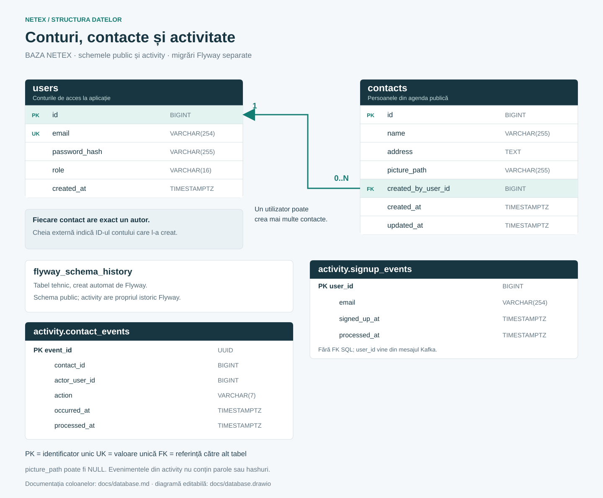
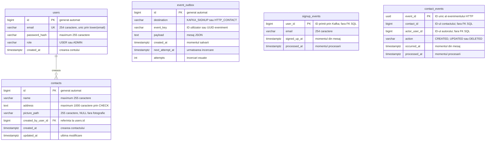

# Baza de date: tabele, relații și DBeaver

Acesta este documentul central pentru structura de date a întregului proiect. Îl actualizăm când adăugăm sau schimbăm un tabel. Diagrama se poate vedea în previzualizarea Markdown care suportă Mermaid și direct pe GitHub.

Diagrama există și ca fișiere independente: [imagine PNG](database.png), [imagine SVG](database.svg) și [diagramă editabilă draw.io](database.drawio). Pentru editare, deschide fișierul `.drawio` în draw.io / diagrams.net prin **File → Open From → Device**. Actualizăm diagrama și exporturile când schimbăm structura tabelelor.



- [Inventarul tabelelor](#inventarul-tabelelor)
- [Diagrama relațiilor](#diagrama-relațiilor)
- [Tabelul users](#tabelul-users)
- [Tabelul contacts](#tabelul-contacts)
- [Tabelul activity.signup_events](#tabelul-activitysignup_events)
- [Tabelul activity.contact_events](#tabelul-activitycontact_events)
- [Exemplu de legătură între rânduri](#exemplu-de-legătură-între-rânduri)
- [Istoricul Flyway](#istoricul-flyway)
- [Datele microserviciului](#datele-microserviciului)
- [Conectarea vizuală în DBeaver](#conectarea-vizuală-în-dbeaver)

## Stadiu

`compose.yaml` pornește aplicația completă: PostgreSQL 17.11, Kafka, backendul, microserviciul și frontendul. Volumele păstrează datele PostgreSQL, Kafka și fotografiile după repornire. Backendul se conectează prin Spring JDBC, iar Flyway aplică V1, V2 și V3 în schema `public`. Microserviciul aplică propriile migrări V1 și V2 în schema `activity`. În baza locală `netex` există tabelele aplicației și câte un istoric Flyway pentru fiecare schemă.

Definițiile executabile sunt [V1__create_users_and_contacts.sql](../backend/src/main/resources/db/migration/V1__create_users_and_contacts.sql), [V2__add_user_role.sql](../backend/src/main/resources/db/migration/V2__add_user_role.sql), [V3__create_event_outbox.sql](../backend/src/main/resources/db/migration/V3__create_event_outbox.sql) și migrațiile microserviciului din `microservice/src/main/resources/db/migration/`. Pasul 6 nu a schimbat schema: coloana `picture_path` exista deja în V1 din backend.

## Inventarul tabelelor

| Componentă | Bază / tabel | Scop | Stare |
| --- | --- | --- | --- |
| `contacts-api` | `netex.public.users` | Conturile persoanelor care se autentifică | Creat prin V1, rol adăugat prin V2 |
| `contacts-api` | `netex.public.contacts` | Contactele din agenda publică | Creat prin V1 |
| `contacts-api` | `netex.public.event_outbox` | Evenimentele Kafka/HTTP care așteaptă livrarea sau reîncercarea | Creat prin V3 |
| Flyway în `contacts-api` | `netex.public.flyway_schema_history` | Evidența modificărilor SQL aplicate | Creat automat de Flyway |
| `activity-service` | `netex.activity.signup_events` | Înregistrările procesate din Kafka | Creat prin V1 a microserviciului |
| `activity-service` | `netex.activity.contact_events` | Modificările contactelor primite prin HTTP | Creat prin V2 a microserviciului |
| Flyway în `activity-service` | `netex.activity.flyway_schema_history` | Evidența migrărilor microserviciului | Creat automat de Flyway |

`netex` este baza de date. `public` și `activity` sunt scheme, adică spații separate de organizare a tabelelor în aceeași bază fizică locală. `contacts-api` deține tabelele din `public`; `activity-service` deține tabelele din `activity`. Fiecare aplicație rulează propriile migrări Flyway. Separarea aceasta ține codul și datele logic distincte, deși configurația simplă de dezvoltare folosește același server și același cont SQL.

Frontendul folosește API-ul Java și nu are o conexiune directă la SQL. Fotografiile sunt fișiere în directorul local `uploads/` sau în volumul Docker `picture_data`; în SQL păstrăm numai numele generat de server. Kafka transportă evenimentele și nu este un tabel SQL.

## Tabelul public.event_outbox

Un rând este un eveniment salvat în aceeași tranzacție cu înregistrarea unui cont sau schimbarea unui contact. Workerul backend îl trimite către Kafka sau prin HTTP și șterge rândul după confirmare. Dacă livrarea eșuează, rândul rămâne pentru o nouă încercare.

| Coloană | Tip SQL | Ce reprezintă |
| --- | --- | --- |
| `id` | `BIGINT` | Cheia primară generată automat |
| `destination` | `VARCHAR(24)` | `KAFKA_SIGNUP` sau `HTTP_CONTACT` |
| `event_key` | `VARCHAR(64)` | ID-ul utilizatorului sau UUID-ul evenimentului de contact |
| `payload` | `TEXT` | Mesajul JSON; nu conține parola |
| `created_at` | `TIMESTAMPTZ` | Când a fost creat rândul |
| `next_attempt_at` | `TIMESTAMPTZ` | Când se poate încerca livrarea din nou |
| `attempts` | `INTEGER` | Numărul încercărilor eșuate |

Acest tabel este temporar: un rând livrat dispare. Istoricul final se află în `activity.signup_events` sau `activity.contact_events`. Relația cu `users` și `contacts` este prin ID-uri în JSON, fără cheie externă SQL; astfel rămâne valid și evenimentul `DELETED` după ștergerea contactului.

## Diagrama relațiilor


```mermaid
erDiagram
    users ||--o{ contacts : "creeaza"

    users {
        bigint id PK "generat automat"
        varchar email UK "254 caractere, unic prin lower(email)"
        varchar password_hash "maximum 255 caractere"
        varchar role "USER sau ADMIN"
        timestamptz created_at "crearea contului"
    }

    contacts {
        bigint id PK "generat automat"
        varchar name "maximum 255 caractere"
        text address "maximum 1000 caractere prin CHECK"
        varchar picture_path "255 caractere, NULL fara fotografie"
        bigint created_by_user_id FK "referinta la users.id"
        timestamptz created_at "crearea contactului"
        timestamptz updated_at "ultima modificare"
    }

    event_outbox {
        bigint id PK "generat automat"
        varchar destination "KAFKA_SIGNUP sau HTTP_CONTACT"
        varchar event_key "ID utilizator sau UUID eveniment"
        text payload "mesaj JSON"
        timestamptz created_at "momentul salvarii"
        timestamptz next_attempt_at "urmatoarea incercare"
        int attempts "incercari esuate"
    }

    signup_events {
        bigint user_id PK "ID primit prin Kafka; fara FK SQL"
        varchar email "254 caractere"
        timestamptz signed_up_at "momentul din mesaj"
        timestamptz processed_at "momentul procesarii"
    }

    contact_events {
        uuid event_id PK "ID unic al evenimentului HTTP"
        bigint contact_id "ID-ul contactului; fara FK SQL"
        bigint actor_user_id "ID-ul autorului; fara FK SQL"
        varchar action "CREATED, UPDATED sau DELETED"
        timestamptz occurred_at "momentul din mesaj"
        timestamptz processed_at "momentul procesarii"
    }
```

Relația în cuvinte: **un utilizator poate crea zero, unul sau mai multe contacte; fiecare contact are exact un autor**. Aceasta este o relație unu-la-mai-mulți. Legătura este `contacts.created_by_user_id → users.id`.

- **PK / PRIMARY KEY / cheie primară:** identifică unic un rând. Două rânduri din același tabel nu pot avea același ID.
- **FK / FOREIGN KEY / cheie externă:** leagă un rând de un rând existent din alt tabel. Un contact nu poate indica un autor inexistent.
- **UK / UNIQUE:** impune unicitatea unei valori, de exemplu emailul unui cont.
- **NOT NULL:** o regulă SQL care cere ca o coloană să aibă o valoare. Un text gol este tot o valoare; pentru el este necesară o validare separată.

## Tabelul users

Un rând reprezintă un cont de acces la aplicație. Acesta este diferit de un contact din agendă și de contul PostgreSQL `netex`, folosit de backend și DBeaver pentru conectare.

| Coloană | Tip SQL | Ce reprezintă | Reguli / comportament |
| --- | --- | --- | --- |
| `id` | `BIGINT` | Identificatorul contului | Cheie primară, `GENERATED ALWAYS AS IDENTITY` |
| `email` | `VARCHAR(254)` | Adresa pentru înregistrare și login | Obligatorie, fără spații la extremități; index unic pe `lower(email)` |
| `password_hash` | `VARCHAR(255)` | Hashul parolei | Obligatoriu; nu păstrăm parola în clar și nu returnăm hashul către frontend |
| `role` | `VARCHAR(16)` | Rolul contului | V2: `USER` implicit sau `ADMIN`; obligatoriu, verificat prin `CHECK` |
| `created_at` | `TIMESTAMPTZ` | Momentul creării contului | Obligatoriu; valoare implicită `CURRENT_TIMESTAMP` |

`BIGINT` este un număr întreg. `VARCHAR(n)` este text cu maximum `n` caractere. `TIMESTAMPTZ` reprezintă un moment în timp; PostgreSQL îl afișează în fusul orar al sesiunii și nu păstrează numele fusului orar original.

Indexul unic `uk_users_email` aplicat pe `lower(email)` refuză, de exemplu, înregistrarea simultană a adreselor `ana@example.com` și `ANA@example.com`. În DBeaver apare în lista de indexuri. Regula `ck_users_email_trimmed` refuză emailurile goale sau cu spații la extremități. Backendul normalizează și validează emailul înainte de salvare. SQL verifică unicitatea independent de codul Java. Hashul nu poate fi un text gol sau format numai din spații. V2 adaugă `ck_users_role`: un rol diferit de `USER` sau `ADMIN` este refuzat de baza de date.

Hashingul transformă parola într-o valoare folosită pentru verificarea autentificării. Spring Security compară parola introdusă la login cu hashul BCrypt salvat. Hashingul nu este o criptare pe care aplicația o inversează ca să recupereze parola. Înregistrarea publică scrie exclusiv rolul `USER`; un cont `ADMIN` poate fi creat doar prin configurarea separată a serverului.

## Tabelul contacts

Un rând reprezintă o persoană din agendă. Persoana din contact nu trebuie să aibă un cont în aplicație: autorul rândului este utilizatorul care a adăugat-o.

| Coloană | Tip SQL | Ce reprezintă | Reguli / comportament |
| --- | --- | --- | --- |
| `id` | `BIGINT` | Identificatorul contactului | Cheie primară, `GENERATED ALWAYS AS IDENTITY` |
| `name` | `VARCHAR(255)` | Numele contactului | Obligatoriu; nu este unic, fiindcă două persoane pot avea același nume |
| `address` | `TEXT` | Adresa contactului | Obligatorie, maximum 1000 de caractere prin `CHECK` |
| `picture_path` | `VARCHAR(255)` | Numele generat al fotografiei | Permite `NULL` când contactul nu are fotografie; dacă este prezentă, valoarea nu poate fi goală. Numele este generat de server |
| `created_by_user_id` | `BIGINT` | Autorul contactului | Obligatoriu; cheie externă către `users.id`; backendul îl ia din sesiunea autentificată |
| `created_at` | `TIMESTAMPTZ` | Momentul creării contactului | Obligatoriu; valoare implicită `CURRENT_TIMESTAMP` |
| `updated_at` | `TIMESTAMPTZ` | Momentul ultimei modificări | Obligatoriu; valoare implicită `CURRENT_TIMESTAMP`; repository-ul îl actualizează la editarea textului sau fotografiei |

`TEXT` nu limitează adresa la nivel de tip, dar constrângerea `ck_contacts_address_valid` impune maximum 1000 de caractere și refuză un text gol sau format numai din spații. Numele are și el o verificare pentru text gol/spații. API-ul aplică limite compatibile. `updated_at` nu se modifică automat doar datorită numelui coloanei sau unui `DEFAULT CURRENT_TIMESTAMP`; comenzile SQL de editare îl actualizează explicit.

Cerința permite încărcarea fotografiei din browser. `picture_path` rămâne `NULL` dacă nu s-a ales o fotografie sau după eliminarea ei. La upload, backendul verifică fișierul și salvează în tabel numai numele generat; fișierul propriu-zis se află în directorul/volumul de fotografii. Nu a fost necesară o nouă migrare pentru pasul 6.

Cheia externă `fk_contacts_author` are `ON DELETE RESTRICT`: PostgreSQL refuză ștergerea unui cont care încă are contacte. Nu există o funcție de ștergere a conturilor în API. Indexul `idx_contacts_author` ajută găsirea contactelor unui autor și verificarea cheii externe. Nu am adăugat un index obișnuit pe nume: acesta nu ar accelera automat o căutare de tip „conține textul”.

La editare și ștergere, backendul permite autorului (`created_by_user_id`) sau unui cont cu rolul `ADMIN`. Același lucru se aplică înlocuirii și eliminării fotografiei. Cheia externă garantează existența autorului; **permisiunea de editare este verificată separat în backend**. Listarea, căutarea și vizualizarea fotografiei rămân publice.

## Tabelul activity.signup_events

Un rând reprezintă un eveniment de înregistrare consumat din topicul Kafka `user-signups`. Tabelul aparține microserviciului, în schema `activity`.

| Coloană | Tip SQL | Ce reprezintă | Reguli |
| --- | --- | --- | --- |
| `user_id` | `BIGINT` | ID-ul contului creat în `public.users` | Cheie primară; împiedică inserarea repetată a aceluiași eveniment |
| `email` | `VARCHAR(254)` | Emailul normalizat al contului | Obligatoriu; nu poate fi gol/spații |
| `signed_up_at` | `TIMESTAMPTZ` | Momentul generat de API în mesaj | Obligatoriu |
| `processed_at` | `TIMESTAMPTZ` | Momentul salvării de către microserviciu | Obligatoriu; valoare implicită `CURRENT_TIMESTAMP` |

`user_id` **nu este cheie externă SQL** către `public.users`: serviciile comunică prin eveniment, iar microserviciul nu citește direct tabelul conturilor. În cazul unei livrări repetate, `INSERT ... ON CONFLICT (user_id) DO NOTHING` păstrează un singur rând. Mesajul nu conține parola sau hashul ei.

## Tabelul activity.contact_events

Un rând reprezintă o modificare de contact trimisă de API-ul principal prin HTTP. Tabelul aparține microserviciului, în schema `activity`; migrarea sa este `V2__create_contact_events.sql`.

| Coloană | Tip SQL | Ce reprezintă | Reguli |
| --- | --- | --- | --- |
| `event_id` | `UUID` | Identificatorul evenimentului | Cheie primară; împiedică inserarea repetată a aceluiași eveniment |
| `contact_id` | `BIGINT` | ID-ul contactului modificat | Obligatoriu, pozitiv; fără FK SQL |
| `actor_user_id` | `BIGINT` | ID-ul utilizatorului care a făcut modificarea | Obligatoriu, pozitiv; fără FK SQL |
| `action` | `VARCHAR(7)` | Tipul modificării | `CREATED`, `UPDATED` sau `DELETED` |
| `occurred_at` | `TIMESTAMPTZ` | Momentul trimis de API | Obligatoriu |
| `processed_at` | `TIMESTAMPTZ` | Momentul salvării de către microserviciu | Obligatoriu; implicit `CURRENT_TIMESTAMP` |

Nu există cheie externă către `public.contacts` sau `public.users`: microserviciul deține propriile date, iar istoricul trebuie să poată păstra și evenimentul `DELETED` după dispariția contactului. O retrimitere cu același `event_id` nu creează încă un rând (`ON CONFLICT DO NOTHING`). Poți vedea tabelul în DBeaver la **Schemas → activity → Tables → contact_events → View Data → All Rows**. După creare, editare și ștergere vei vedea același `contact_id` cu cele trei acțiuni. Înlocuirea sau eliminarea fotografiei produce `UPDATED`.

## Exemplu de legătură între rânduri

Date fictive, numai pentru explicație; nu sunt inserate în baza de date.

`users` (afișăm doar coloanele relevante):

| id | email |
| --- | --- |
| 1 | ana@example.com |
| 2 | mihai@example.com |

`contacts` (afișăm doar coloanele relevante):

| id | name | created_by_user_id |
| --- | --- | --- |
| 10 | Maria Popescu | 1 |
| 11 | Andrei Ionescu | 1 |
| 12 | Elena Georgescu | 2 |

Ana a creat contactele 10 și 11. Mihai a creat contactul 12. Un contact cu `created_by_user_id = 999` ar fi refuzat dacă utilizatorul 999 nu există. ID-urile din cele două tabele au roluri diferite: `contacts.id` identifică un contact, iar `users.id` identifică un cont.

## Istoricul Flyway

Flyway a creat și administrează două tabele independente: `public.flyway_schema_history` pentru backend și `activity.flyway_schema_history` pentru microserviciu. Nu au relații de tip cheie externă cu tabelele aplicației.

Structura este furnizată de Flyway, nu o definim manual. Coloanele verificate în baza locală sunt:

| Coloană | Tip SQL | Scop |
| --- | --- | --- |
| `installed_rank` | `INTEGER` | Ordinea aplicării; cheia primară |
| `version` | `VARCHAR` | Versiunea migrării; poate fi NULL pentru alte tipuri de migrări |
| `description` | `VARCHAR` | Descrierea migrării |
| `type` | `VARCHAR` | Tipul migrării, de exemplu SQL |
| `script` | `VARCHAR` | Numele fișierului executat |
| `checksum` | `INTEGER` | Valoare folosită pentru a detecta schimbarea fișierului; poate fi NULL |
| `installed_by` | `VARCHAR` | Utilizatorul bazei care a aplicat migrarea |
| `installed_on` | `TIMESTAMP` | Momentul aplicării; acest câmp tehnic este fără fus orar |
| `execution_time` | `INTEGER` | Durata execuției în milisecunde |
| `success` | `BOOLEAN` | Dacă migrarea a reușit |

Migrațiile backendului sunt `V1__create_users_and_contacts.sql`, `V2__add_user_role.sql` și `V3__create_event_outbox.sql`. Migrațiile noi modifică schema fără să rescrie fișierele vechi. Microserviciul are propria V1, `V1__create_signup_events.sql`, și V2, `V2__create_contact_events.sql`, urmărite în schema `activity`. Numerotarea pornește separat pentru fiecare serviciu. Flyway verifică checksumul fiecărui fișier și semnalează schimbările ulterioare.

## Datele microserviciului

`activity-service` procesează înregistrări primite prin Kafka și le salvează în `activity.signup_events`. Primește prin HTTP evenimente despre contacte și le salvează în `activity.contact_events`.

Rolul `USER`/`ADMIN` există în V2 și în diagramă. Backendul protejează `/api/admin/activities` și citește prin HTTP ultimele 100 de rânduri din fiecare tabel de activitate; pagina React este vizibilă numai pentru ADMIN.

ID-urile din mesaje reprezintă legături logice cu utilizatori și contacte, fără relații FK între tabelele celor două servicii.

## Cum păstrăm documentul actualizat

La fiecare schimbare de schemă, actualizăm în același pas inventarul, diagrama, coloanele și starea implementării. Migrarea SQL aplicată este definiția executabilă; documentul trebuie să corespundă acelei definiții. Același principiu se aplică viitoarelor tabele ale microserviciului.

## Ce reprezintă fiecare componentă

- PostgreSQL este programul care păstrează și gestionează bazele de date.
- Imaginea Docker conține PostgreSQL și fișierele necesare rulării lui.
- Containerul este instanța pornită din acea imagine.
- Volumul `postgres_data` păstrează datele independent de container.
- DBeaver este aplicația prin care vezi bazele, tabelele și rândurile.
- Flyway execută migrările SQL neaplicate la pornirea backendului.

## Pornirea bazei

1. Deschide Docker Desktop și așteaptă pornirea motorului Docker.
2. În rădăcina repository-ului, copiază `.env.example` în `.env` doar dacă nu există deja `.env`. Alege o parolă locală în fișierul nou.
3. Din același director rulează `docker compose up -d --wait postgres`.

`-d` lasă containerul în fundal. `--wait` așteaptă verificarea de disponibilitate. Comanda `pg_isready` din `healthcheck` verifică dacă PostgreSQL acceptă conexiuni; nu verifică parola clientului sau existența tabelelor aplicației. Conectarea din DBeaver verifică și datele de autentificare.

În `compose.yaml`, `image` alege versiunea, `environment` trimite setările bazei către container, `ports` permite accesul de pe laptop, iar `volumes` păstrează datele. `${POSTGRES_DB:-netex}` înseamnă valoarea din mediu sau, dacă lipsește, `netex`. Pentru parolă, expresia `:?` oprește pornirea cu un mesaj clar dacă valoarea lipsește. `$$` din verificarea de disponibilitate lasă variabila să fie citită în container.

Portul este publicat numai pe `127.0.0.1:5432`, pentru acces local. `netex` este numele bazei și, implicit, numele contului PostgreSQL de dezvoltare. Acest cont este creat de imagine cu drepturi de administrare locală și este diferit de viitorii utilizatori ai aplicației.

## Conectarea vizuală în DBeaver

1. Deschide **Database → New Database Connection**.
2. Alege **PostgreSQL**, apoi **Next**.
3. Completează:

| Câmp | Valoare implicită |
| --- | --- |
| Host | `localhost` |
| Port | `5432` |
| Database | `netex` |
| Username | `netex` |
| Password | Valoarea de după `POSTGRES_PASSWORD=` din fișierul `.env` de la rădăcină |

4. Apasă **Test Connection**. La prima folosire, DBeaver poate cere descărcarea driverului PostgreSQL; acesta îi permite să comunice cu serverul.
5. După mesajul de succes, apasă **Finish**.
6. În navigator, extinde conexiunea, apoi **Schemas → public → Tables** și **Schemas → activity → Tables**. În funcție de configurarea navigatorului, poate apărea și nivelul **Databases → netex**.

După pornirea ambelor aplicații, dă **Refresh** pe conexiune sau pe **Schemas**. În `public` vezi `users`, `contacts`, `event_outbox` și `flyway_schema_history`; în `activity` vezi `signup_events`, `contact_events` și `flyway_schema_history`. Pentru coloane, deschide tabelul și secțiunea **Columns**; pentru rânduri, folosește **View Data → All Rows**. După o înregistrare nouă, rândul utilizatorului este în `public.users`, iar procesarea Kafka apare în `activity.signup_events`. După schimbarea unui contact, evenimentul HTTP apare în `activity.contact_events`. `event_outbox` poate fi gol când verifici: rândurile confirmate se șterg.

O eroare de conexiune refuzată indică de obicei un container oprit sau un port greșit. O eroare de autentificare cere verificarea utilizatorului și parolei. Schimbarea parolei în `.env` după inițializarea volumului nu schimbă automat parola din PostgreSQL.

## Date persistente și oprire

`docker compose stop postgres` oprește containerul. `docker compose up -d --wait postgres` îl pornește din nou. `docker compose down` elimină containerul și rețeaua proiectului, dar păstrează volumul cu date. Opțiunea `down -v` șterge și volumul cu baza; nu o folosi pentru o oprire obișnuită. Volumul local nu este trimis pe GitHub.

## Pornirea backendului cu baza locală

Un profil Spring este un set de configurări pentru un anumit mod de rulare. Am adăugat profilul `local`, care citește `.env` de la rădăcina repository-ului. Nu copiază parola în cod sau în Git.

După pornirea PostgreSQL, din directorul `backend` rulează în PowerShell:

```powershell
.\mvnw.cmd spring-boot:run "-Dspring-boot.run.profiles=local"
```

În IntelliJ: **Run → Edit Configurations → ContactsApiApplication**, cu **Program arguments** `--spring.profiles.active=local` și **Working directory** setat la directorul `backend` al proiectului. La nevoie, afișează câmpul Program arguments din **Modify options**. Reîncarcă proiectul Maven după schimbările din `pom.xml`.

`application.properties` configurează conexiunea la PostgreSQL. `application-local.properties` adaugă `spring.config.import=file:../.env[.properties]`: `../` înseamnă directorul părinte al directorului de lucru, iar `[.properties]` spune cum să fie citit fișierul. Păstrează `.env` în format simplu `KEY=value`, fără ghilimele, `export`, backslashuri sau substituții de variabile. Docker citește `.env` pentru Compose; Spring îl citește numai prin acest profil explicit. La rularea din Docker vom transmite variabilele direct, fără profilul `local`.

Valorile folosite sunt `POSTGRES_HOST` (implicit localhost), `POSTGRES_PORT` (5432), `POSTGRES_DB` (netex), `POSTGRES_USER` (netex) și `POSTGRES_PASSWORD` (fără parolă implicită). Modificarea hostului sau portului backendului nu schimbă automat configurația Compose. În Docker, hostul va fi numele serviciului `postgres`.

La prima pornire vezi în log aplicarea V1, V2 și V3. Dacă V1 și V2 există deja, Flyway aplică doar V3. La următoarele porniri, validează fișierele și raportează că schema este actualizată. Backendul nu poate porni complet dacă baza nu este disponibilă sau autentificarea eșuează. `/api/health` include verificarea conexiunii SQL, dar ascunde detaliile interne.

## Verificări efectuate

Testcontainers pornește PostgreSQL 17.11 temporar, aplică V1, V2 și V3 pe o bază goală și îl închide după teste. Nu folosește baza `netex` și nu are nevoie de parola ei. Testele curente verifică migrările, regulile SQL, API-ul, autentificarea cu sesiune și CSRF, precum și relivrarea evenimentelor.

Backendul cu profilul `local` a aplicat V2 peste V1 în `netex`; logul a confirmat schema la versiunea 2. Verificarea inițială, înainte de simplificarea autentificării, a confirmat health `UP`, lista publică goală și răspunsul 401 pentru `/api/auth/me` fără login. PostgreSQL rămâne disponibil pentru inspecție în DBeaver. Verificarea integrată a variantei fără CSRF este încă de efectuat când Docker este disponibil.

Pasul 9 este implementat: schema `activity` păstrează atât înregistrările Kafka, cât și modificările contactelor primite prin HTTP. Verificarea reală a observat `CREATED`, `UPDATED` și `DELETED` pentru același contact. Pasul 10 pornește toate cele cinci servicii prin Compose; explicația amplă a proiectului se va face apoi, conform planului.
